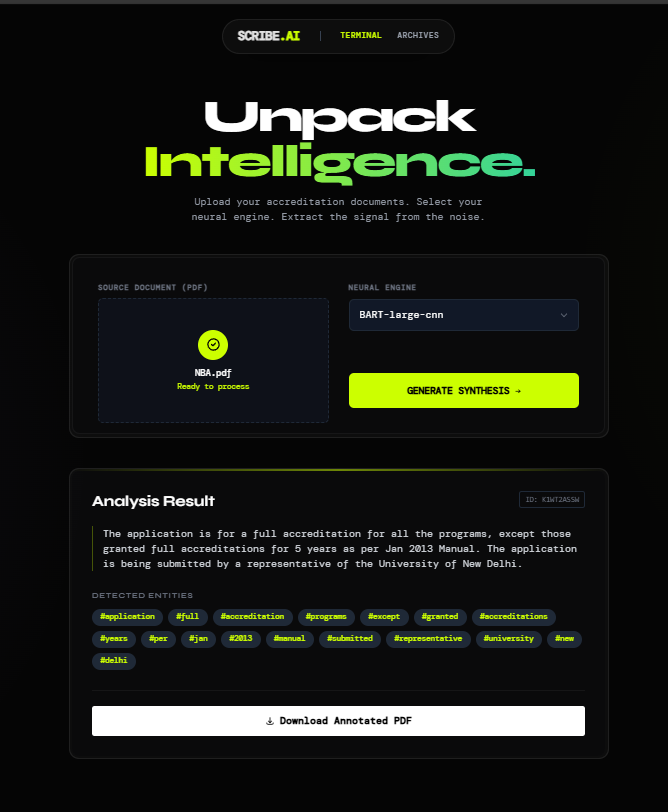

# PDF Summarizer 



## About The Project

This tool is designed to assist educational institutions in processing and understanding lengthy accreditation documents, specifically for NAAC (National Assessment and Accreditation Council) and NBA (National Board of Accreditation) purposes.

It provides a streamlined web interface where users can upload large PDF files. The backend then processes these documents to generate concise summaries, identify key points, and highlight relevant sections. This helps administrators and faculty quickly extract the most important information without needing to read through hundreds of pages manually. The application also keeps a history of summarized documents for easy reference.

## Features

*   **PDF Upload**: Simple drag-and-drop or file selection interface to upload large PDF documents.
*   **Automated Summarization**: Leverages natural language processing to create accurate summaries of the document's content.
*   **Key Section Highlighting**: A Python service works to identify and visually highlight the most critical sections within the PDF.
*   **Model Selection**: Provides options to choose between different processing models to tailor the output.
*   **Summary History**: Previously generated summaries are saved and can be accessed at any time.

## Tech Stack

This project is built with a modern, full-stack architecture:

*   **Frontend**:
    *   React.js
    *   Vite
    *   Tailwind CSS
    *   Axios

*   **Backend**:
    *   Node.js
    *   Express.js
    *   Mongoose
    *   PDF-Parse

*   **Python Service**:
    *   Used for computer vision and text highlighting tasks.

## Getting Started

To get a local copy up and running, please follow these simple steps.

### Prerequisites

You will need Node.js, npm, and Python installed on your machine.

### Installation

1.  **Clone the repository:**
    ```sh
    git clone <your-repository-url>
    cd NAAC_NBA_PDF_Summarizer
    ```

2.  **Set up the Backend:**
    *   Navigate to the backend directory:
        ```sh
        cd backend
        ```
    *   Install the required packages:
        ```sh
        npm install
        ```
    *   Create a `.env` file by copying the example. You will need to add your MongoDB connection string and any other required environment variables.
        ```sh
        # Create a .env file and add your variables
        # Example:
        # PORT=3000
        # MONGO_URI=mongodb://...
        ```
    *   Start the backend server:
        ```sh
        npm start
        ```
    The server will be running on the port you specified in your `.env` file.

3.  **Set up the Frontend:**
    *   In a new terminal, navigate to the frontend directory:
        ```sh
        cd frontend
        ```
    *   Install the required packages:
        ```sh
        npm install
        ```
    *   Start the development server:
        ```sh
        npm run dev
        ```
    The application will be available at `http://localhost:5173` (or another port if 5173 is in use).

4.  **Set up the Python Service:**
    *   In another terminal, navigate to the Python service directory:
        ```sh
        cd python-cv-service
        ```
    *   It is recommended to use a virtual environment:
        ```sh
        python -m venv venv
        source venv/bin/activate  # On Windows use `venv\Scripts\activate`
        ```
    *   Install the dependencies:
        ```sh
        pip install -r requirements.txt
        ```
    *   Run the main Python application:
        ```sh
        uvicorn main:app --host 0.0.0.0 --port 8001
        ```

## Usage

Once all services are running, open your web browser and navigate to the frontend URL. From there, you can upload a PDF document, select your desired summarization model, and view the results. Your past summaries can be found on the "History" page.